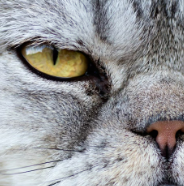
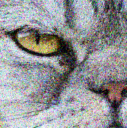
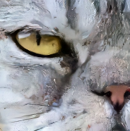
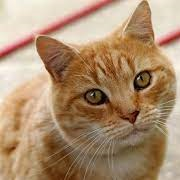
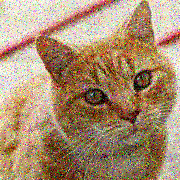
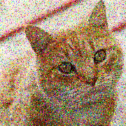
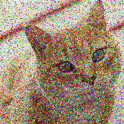
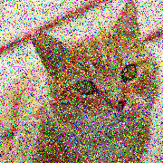
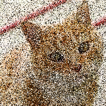

# Team Introduction
- Name: 이승준(202211337) 
- Github ID: somniumcaeruleumKonkuk 
- Team type: Individual

# Topic Introduction
- Implementing DnCNN Image Denoising using Tensorflow
- Original: https://github.com/wbhu/DnCNN-tensorflow
    - Because the original code was for old version of tensorflow, I edited main.py, model.py for tensorflow 2.

# Results
## Original Image


- Image Source: https://www.nationalgeographic.com/adventure/article/140127-cats-pets-animals-nation-dogs-people-science
- PHOTOGRAPH BY FSTOP, ALAMY

## Noised Image


- I added noises to the original image using https://pinetools.com/add-noise-image.
- Amount of Noise: 50
- Strength of the noise: 50
- Monochromatic: False

## Denoised Image



# Analysis/Visualization
## Test Set
- I added noises to the original image using https://pinetools.com/add-noise-image.

### Original Image

- Image Source: https://commons.wikimedia.org/wiki/File:Cat03.jpg

### Image 1

- Amount of Noise: 50
- Strength of the noise: 20
- Monochromatic: False

### Image 2

- Amount of Noise: 50
- Strength of the noise: 40
- Monochromatic: False

### Image 3

- Amount of Noise: 50
- Strength of the noise: 60
- Monochromatic: False

### Image 4

- Amount of Noise: 50
- Strength of the noise: 80
- Monochromatic: False

### Image 5

- Amount of Noise: 50
- Strength of the noise: 100
- Monochromatic: False

### Image 6

- Amount of Noise: 50
- Strength of the noise: 100
- Monochromatic: True

## Denoised Images

### Image 1


### Image 2


### Image 3


### Image 4


### Image 5


### Image 6


# Installation
- Install numpy, opencv, tensorflow.

## Environment: 
    Numpy version: 1.23.5
    Opencv version: 4.7.0
    Tensorflow version: 2.12.0
    OS: Windows 11 Education (the latest version in 6/1/2023)
    
## Data preprocessing and noise generation
"
Before training, you have to rescale the images to 180x180 and adding noise to them.
The folder structure is supposed to be:
```
./data/train/original  for the 180x180 original train images
./data/train/noisy  for the 180x180 noisy train images
./data/test/original  for the 180x180 original test images
./data/test/noisy  for the 180x180 noisy test images
```
You need the original files for testing just to calculate the PSNR.
You can denoise without original files: just put the noisy files also in ./data/test/original
" - https://github.com/wbhu/DnCNN-tensorflow

## How to Train
```
./data/train/original  put the 180x180 original train images here
./data/train/noisy  put the 180x180 noisy train images here
```

- Put the images at the right places
- Start cmd
- Move to the directory that the main.py exists using cd command
- Enter the command below.
```
python main.py
```

## How to Test
```
./data/test/original put the 180x180 original test images here *it's totally ok to put the same image here
./data/test/noisy  put the 180x180 noisy test images here 
```

- Put the images at the right places
- Start cmd
- Move to the directory that the main.py exists using cd command
- Enter the command below.
```
python main.py --phase test
```

# Presentation
- (currently empty)
