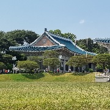

# Hello World!
- This repository is for the homework of my university.
- This is a tensorflow implementation of the paper [Beyond a Gaussian Denoiser: Residual Learning of Deep CNN for Image Denoising](http://www4.comp.polyu.edu.hk/~cslzhang/paper/DnCNN.pdf)
- Original Code: https://github.com/wbhu/DnCNN-tensorflow
    - Because the original code is outdated, I fixed several part of the codes for new versions.
    - I'm sure that one day this code will be outdated, too.
    - But I hope that someone will update this code at that time.

# Team Introduction
- Name: 이승준(202211337) 
- Github ID: somniumcaeruleumKonkuk 
- Team type: Individual

# Topic Introduction
- Implementing DnCNN Image Denoising using Tensorflow
- Original: https://github.com/wbhu/DnCNN-tensorflow

# Results


# Analysis/Visualization
## Original Image


## Noised Images

## Denoised Images


## Conclusion
- Noise의 양(amount)과 강도(strength)가 클수록 디노이징(denoising) 잘 되지 않는 것을 볼 수 있었다. Noise의 강도(strength)가 작을 때는 양(amount)이 크게 영향을 주지 못했으나, Noise의 강도(strength)가 60을 넘은 후 부터는 양(amount)가 상당히 denoised image들의 화질에 영향을 미치는 중요한 변수임을 볼 수 있었다.
- As the amount and strength of noise increased, you can see that the quality of the denoised images isn't good in the above experiment. When the strength was low, the amount of noise didn't matter that much. As the strength is over 60, however, the amount of noise was important variable to the quality.


# Installation
- Install numpy, opencv, tensorflow.

## Environment: 
    Numpy version: 1.23.5
    Opencv version: 4.7.0
    Tensorflow version: 2.12.0
    OS: Windows 11 Education (the latest version in 6/1/2023)
    
## Data preprocessing and noise generation
"
Before training, you have to rescale the images to 180x180 and adding noise to them.
The folder structure is supposed to be:
```
./data/train/original  for the 180x180 original train images
./data/train/noisy  for the 180x180 noisy train images
./data/test/original  for the 180x180 original test images
./data/test/noisy  for the 180x180 noisy test images
```
You need the original files for testing just to calculate the PSNR.
You can denoise without original files: just put the noisy files also in ./data/test/original
" - https://github.com/wbhu/DnCNN-tensorflow

## How to Train
```
./data/train/original  put the 180x180 original train images here
./data/train/noisy  put the 180x180 noisy train images here
```

- Put the images at the right places
- Excute cmd
- Move to the directory that the main.py exists using cd command
- Enter the command below.
```
python main.py
```

## How to Test
```
./data/test/original put the 180x180 original test images here *it's totally ok to put the same image here
./data/test/noisy  put the 180x180 noisy test images here 
```

- Put the images at the right places
- Excute cmd
- Move to the directory that the main.py exists using cd command
- Enter the command below.
```
python main.py --phase test
```

# Presentation
- (currently empty)
